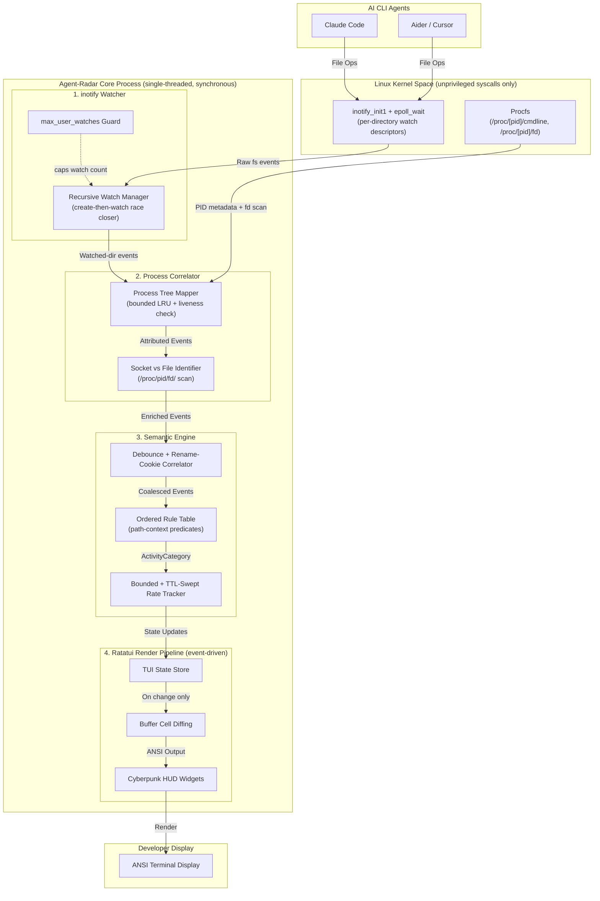
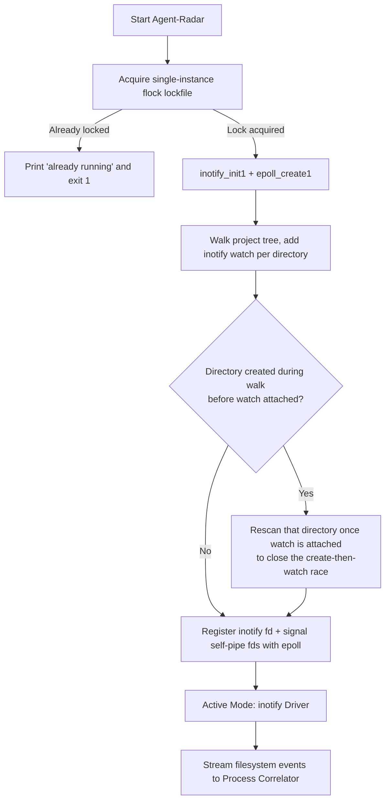
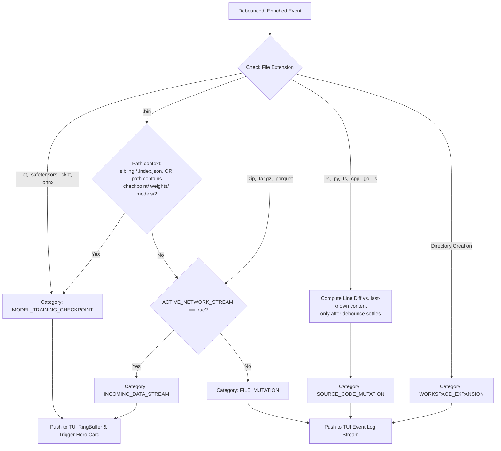
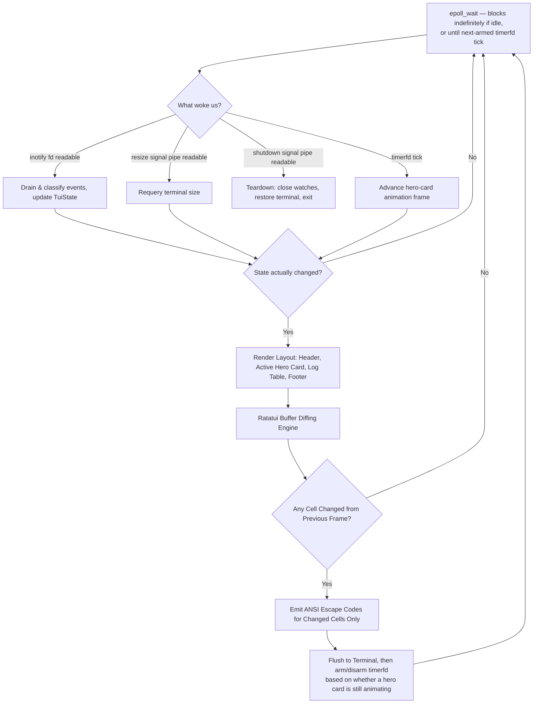
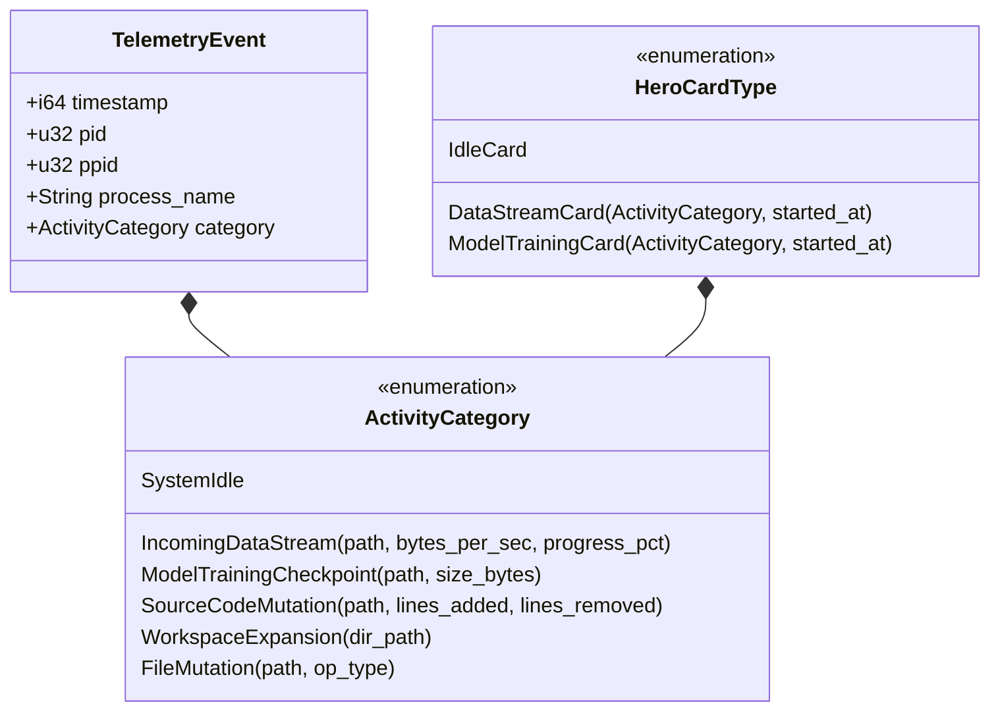
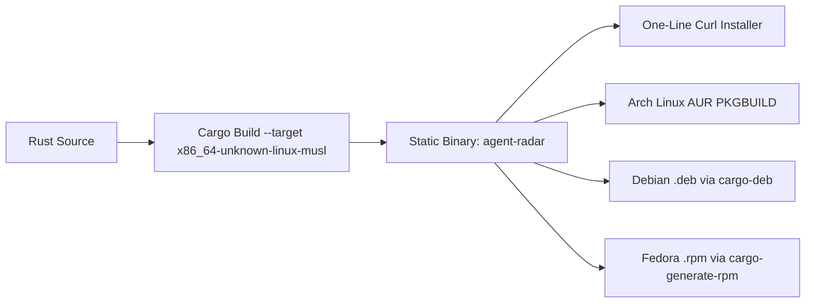

# Architecture Specification: Agent-Radar (Real-Time Terminal Telemetry HUD)

> **Revision note**: This revision corrects 12 verified design flaws in the previous draft — most importantly, a core contradiction where the doc's "ultra-lightweight, zero-overhead" promise was undercut by making eBPF (which needs root/`CAP_BPF`, a clang/libbpf toolchain, and BTF/CO-RE kernel support) the *primary* driver. v1 scope now ships on **inotify + epoll only** — no root, no special kernel capabilities, no privileged syscalls — with eBPF and fanotify demoted to an explicitly deferred v2 "power tier." The MCP/OpenTelemetry socket listener and Kitty graphics protocol are also deferred out of v1. See §9 for the full list of fixes and the v2 roadmap.

## 1. Executive Summary & Core Philosophy

**Agent-Radar** is an ultra-lightweight, zero-privilege, real-time workspace activity HUD designed to monitor, categorize, and visually stream AI CLI agent behavior (e.g., Claude Code, Aider, Antigravity, Cursor CLI) directly inside a Linux terminal.

When AI coding assistants perform rapid background tasks — such as batch file edits, checkpointing model weights, or pulling datasets/dependencies from remote endpoints — standard CLI stdout logs produce telemetry overload. Agent-Radar decouples event logging from the AI agent by watching the project's filesystem tree via the kernel's **inotify** API and correlating activity against the process tree via **procfs**. It transforms raw filesystem events into high-signal, sci-fi/cyberpunk terminal visualizations while running as a **normal, unprivileged user process** — no `sudo`, no `setcap`, no kernel capability requirements.

**v1 design priorities, in order**: (1) runs for any user with zero privilege escalation, (2) genuinely idles at ~0% CPU, (3) stays well under 10MB RSS, (4) ships as a single static binary with a minimal dependency tree. A privileged, lower-latency "power tier" (fanotify, then eBPF) is an explicit **v2+** roadmap item, never a v1 requirement — see §9.2.

---

## 2. High-Level Architecture & System Context Diagrams

### 2.1 System Context Diagram

```
┌──────────────────────────────────────────────────────────────────────────────────┐
│                                  LINUX KERNEL                                    │
│   ┌────────────────────────┐                        ┌─────────────────────┐     │
│   │  inotify (per-dir watch)│                       │ Procfs (/proc/<pid>)│     │
│   └───────────┬────────────┘                        └──────────┬──────────┘     │
└───────────────┼─────────────────────────────────────────────────┼───────────────┘
                │ IN_CREATE / IN_CLOSE_WRITE /                     │ Process Tree
                │ IN_MOVED_FROM/TO / IN_DELETE                     │ & fd/ socket inspection
                ▼                                                 ▼
┌──────────────────────────────────────────────────────────────────────────────────┐
│                                  AGENT-RADAR HUD                                 │
│  ┌──────────────────────┐    ┌─────────────────────────┐    ┌─────────────────┐  │
│  │ inotify Watcher       │───►│ Process Correlator      │───►│ Semantic        │  │
│  │ (recursive, epoll)    │    │ (PID & Ancestry Mapper) │    │ Classifier      │  │
│  └──────────────────────┘    └─────────────────────────┘    └────────┬────────┘  │
│                                                                      │           │
│  ┌──────────────────────┐    ┌─────────────────────────┐             │ State     │
│  │ Ratatui Render Engine│◄───│ TUI State Manager       │◄────────────┘ Delta     │
│  │ (event-driven diff)  │    │ (RingBuffer / History)  │                         │
│  └──────────┬───────────┘    └─────────────────────────┘                         │
└─────────────┼────────────────────────────────────────────────────────────────────┘
              │ ANSI Escape Sequences (only on redraw — see §5.3)
              ▼
┌──────────────────────────────────────────────────────────────────────────────────┐
│                         DEVELOPER TERMINAL (tmux / split)                         │
│  ╭────────────────────────────────────────────────────────────────────────────╮  │
│  │  [!] SOURCE_CODE_MUTATION :: src/main.rs  +42 / -11                        │  │
│  │  >> MODEL_TRAINING_CHECKPOINT :: checkpoints/epoch-04.safetensors (812 MB) │  │
│  ╰────────────────────────────────────────────────────────────────────────────╯  │
└──────────────────────────────────────────────────────────────────────────────────┘
```

No kernel module, BPF bytecode, or elevated capability is loaded anywhere in this path. The only kernel-privileged primitives in v1 are plain `inotify_init1`, `epoll_create1`, `flock`, `timerfd_create`, and reading `/proc/<pid>/*` for processes owned by the invoking user — all available to an unprivileged process by default.

### 2.2 Mermaid System Context & Component Interaction Diagram



---

## 3. End-to-End System Flowcharts

### 3.1 Watcher Initialization Flowchart

Agent-Radar no longer probes for elevated capabilities on boot. v1 always runs the unprivileged inotify tier; a privileged tier is only ever engaged if the user explicitly opts in (v2, see §9.2).



If `fs.inotify.max_user_watches` is exceeded while walking a very large tree, Agent-Radar logs a warning and continues watching the directories it already holds watches for, rather than failing outright — the project root and already-added subtrees stay monitored even if the deepest/largest subtree had to be skipped.

### 3.2 Event Processing & Attribution Flowchart

```mermaid
flowchart TD
    A[Receive raw inotify event] --> B{Is Path Ignored?<br/>.git, node_modules, __pycache__, target}
    B -- Yes --> C[Discard Event]
    B -- No --> D{Event Type}

    D -- IN_CREATE on directory --> E[Add watch + rescan for race window]
    D -- IN_MOVED_FROM / IN_MOVED_TO --> F[Pair by rename cookie:<br/>treat as content-replace on logical path]
    D -- IN_CLOSE_WRITE --> G[Enqueue into per-path debounce window ~300-500ms]

    E --> M[Pass to Semantic Classifier]
    F --> M
    G --> H[Debounce window elapsed, no further writes?]
    H -- No, more writes arrived --> G
    H -- Yes --> I[Resolve writer PID's process tree<br/>via /proc/PID/cmdline + /proc/PID/ppid]

    I --> J{Matches AI Agent Ancestor?<br/>claude, aider, python, node}
    J -- No --> K[Tag as Unrelated Background I/O]
    J -- Yes --> L[Tag as AI Agent Activity]

    K --> N[Inspect /proc/PID/fd/ Symlinks]
    L --> N
    N --> O{Has Active Socket fd:<br/>socket:[inet]?}
    O -- Yes --> P[Set Flag: ACTIVE_NETWORK_STREAM = true]
    O -- No --> Q[Set Flag: LOCAL_DISK_MUTATION = true]

    P --> M
    Q --> M
```

The socket-vs-disk differentiation (`/proc/<pid>/fd/` inspection) requires no elevated privilege — a process can always read its own and its own-user's `/proc/<pid>/fd/` symlinks — so this capability is retained from the original design unchanged.

### 3.3 Semantic Heuristic & Classifier Flowchart

The rule table is now **ordered with path-context predicates** instead of a flat extension map, which resolves the `.bin` ambiguity from the previous draft (a `.bin` file is just as commonly a sharded model-checkpoint file as a generic archive).



Line-diffing is explicitly gated behind the debounce step from §3.2 — it never runs per raw `write()`/`IN_MODIFY` event, only once a file's writes have settled, which also makes it safe to use the file's final on-disk content instead of trying to track an inode that may have changed under an atomic save (write-temp + rename).

### 3.4 Ratatui Render Pipeline Flowchart

The render loop is **event-driven**, not a perpetual timer. A `timerfd` heartbeat used for animation frames is armed only while a hero card is actively animating; at idle, the process blocks on `epoll_wait(-1)` with zero scheduled wakeups.



This closes the original gap where "skip TTY write" was the *only* idle-CPU protection — here, the process does not even wake up on a schedule when idle, because no timer is armed until there is animated content to drive.

---

## 4. Class, Module & Data Structure Diagrams

### 4.1 Module Architecture (v1)

```
┌─────────────────────────────────────────────────────────────────────────────────┐
│                                 MODULE ARCHITECTURE (v1)                         │
│                                                                                 │
│   ┌────────────────────────────────┐         ┌──────────────────────────────┐   │
│   │   <<trait>> EventSource        │         │  <<struct>> ProcessCorrelator│   │
│   ├────────────────────────────────┤         ├──────────────────────────────┤   │
│   │ + poll_fd(&self) -> RawFd      │         │ - pid_cache: LruCache<u32,…>  │   │
│   │ + drain(&mut self) -> Vec<Raw> │         │   (capacity 512, TTL 30s,     │   │
│   └───────────────▲────────────────┘         │    liveness re-checked)      │   │
│                   │                          │ - agent_patterns: Vec<Regex> │   │
│     ┌─────────────┴─────────────┐            ├──────────────────────────────┤   │
│     │  InotifyWatcher (v1, only impl)│         │ + correlate(raw) -> Enriched │   │
│     ├──────────────────────────────┤         │ + get_ancestor_agent(pid)    │   │
│     │ - inotify_fd: OwnedFd        │         │ + has_active_socket(pid)     │   │
│     │ - watch_descriptors: HashMap │         └──────────────┬───────────────┘   │
│     │ - path_by_wd: HashMap       │                        │ EnrichedEvent     │
│     └──────────────────────────────┘                       ▼                   │
│                                                      ┌──────────────────────────────┐   │
│                                                      │<<struct>> SemanticClassifier │   │
│                                                      ├──────────────────────────────┤   │
│                                                      │ - rate_trackers: LruCache     │   │
│                                                      │   (capacity 2048, TTL 30s)    │   │
│                                                      │ - debounce: HashMap<Path,…>   │   │
│                                                      │ - rules: [Rule; N] (ordered)  │   │
│                                                      ├──────────────────────────────┤   │
│                                                      │ + classify(e) -> Category    │   │
│                                                      └──────────────┬───────────────┘   │
│                                                                     │ ActivityCategory  │
│                                                                     ▼                   │
│   ┌────────────────────────────────┐         ┌──────────────────────────────┐   │
│   │       <<struct>> TuiState      │◄────────│      <<struct>> AppRunner    │   │
│   ├────────────────────────────────┤         ├──────────────────────────────┤   │
│   │ + events: VecDeque<Telemetry>  │         │ - epoll_fd: OwnedFd           │   │
│   │ + active_hero: Option<HeroCard>│         │ - timerfd: Option<OwnedFd>    │   │
│   │ + fps_counter: FpsTracker      │         │ - terminal: Terminal<Crossterm>│  │
│   │ + system_metrics: SysStats     │         ├──────────────────────────────┤   │
│   └───────────────▲────────────────┘         │ + run_loop(&mut self)        │   │
│                   │                          │ + shutdown(&mut self)        │   │
│                   │ Renders Layout            └──────────────┬───────────────┘   │
│   ┌───────────────┴─────────────────────────────────────────────────────────┐   │
│   │                             UI WIDGETS                                  │   │
│   │  ┌─────────────────┐  ┌──────────────────┐  ┌───────────────────────┐   │   │
│   │  │ HeaderBarWidget │  │ HeroStreamWidget │  │ LogFeedTableWidget    │   │   │
│   │  └─────────────────┘  └──────────────────┘  └───────────────────────┘   │   │
│   └─────────────────────────────────────────────────────────────────────────┘   │
└─────────────────────────────────────────────────────────────────────────────────┘
```

Note the `EventSource` trait has exactly **one** implementation in v1 (`InotifyWatcher`); it still exists as a trait boundary so a v2 privileged tier can be added later (§9.2) without reshaping the Correlator/Classifier/TUI layers — but no `EbpfObserver`/`FanotifyObserver` types are compiled or linked in v1.

### 4.2 Rust Data Types & Enum Hierarchy (corrected data model)

The previous draft had `TelemetryEvent` carrying flat `raw_path`/`size_bytes` fields *while* `ActivityCategory` variants separately re-carried `file_path`/`tensor_size_mb`/etc. — the same data twice, with no single source of truth. Corrected: `TelemetryEvent` is a thin envelope; **all** path/size/rate data lives exactly once, inside the `ActivityCategory` variant that produced it.



`HeroCardType` now wraps the *same* `ActivityCategory` value plus pure UI/animation state (`started_at`, frame counters) — it does not redeclare `url`/`path`/progress fields a second time.

---

## 5. Subsystem Specifications

### Layer 1: Filesystem Telemetry Engine (v1: inotify only)

Agent-Radar v1 uses a single, unprivileged driver:

* **Kernel API**: `inotify_init1` + per-directory `inotify_add_watch`, multiplexed through `epoll_wait` alongside the signal self-pipes and `timerfd` described in §3.4. No capability beyond standard file read access is required.
* **Recursive watch emulation**: inotify has no native recursive-watch flag. Agent-Radar walks the tree at startup adding one watch per directory, and on every `IN_CREATE` for a new directory it immediately (a) adds a watch to the new directory and (b) rescans that directory once, to close the race window between the directory's creation and the watch being attached (otherwise files created in that window would be silently missed).
* **Watch budget guard**: before walking a very large tree, Agent-Radar checks `fs.inotify.max_user_watches` and warns (rather than silently failing) if the project tree would exceed it, continuing to watch whatever it successfully registered.
* **Debounce & rename correlation**: raw events are not forwarded 1:1. Writes are coalesced per path over a short debounce window (~300-500ms), and inotify's `cookie` field is used to pair `IN_MOVED_FROM`/`IN_MOVED_TO` so an atomic save (editors commonly write a temp file then rename it over the original) is recognized as "content replaced for this logical path" instead of being seen as an unrelated delete + create.

### Layer 2: Process Correlator & AI Agent Attribution

Raw filesystem events are enriched by identifying *who* initiated the action — this layer is unchanged in spirit from the original draft, with two corrections: bounded memory and liveness-checked caching.

1. **Procfs Tree Inspection**:
   * Reads `/proc/<pid>/cmdline`, `/proc/<pid>/stat`, and `/proc/<pid>/ppid`.
   * Maps child sub-processes (e.g., `git`, `curl`, `pip`, `python`) back to the root AI CLI ancestor process (e.g., `claude-code`, `aider`).
   * Results are cached in a **fixed-capacity LRU** (default 512 entries) with entries evicted after 30s of inactivity; a cache hit is liveness-checked against `/proc/<pid>` before being trusted, so a reused PID from an unrelated, later-spawned process can never be misattributed to a stale cache entry.
2. **Network Socket vs. Disk I/O Differentiation**:
   * Inspects `/proc/<pid>/fd/` symlinks — no elevated privilege needed for a process's own-user fds.
   * If a process shows steady growth on a file under a download-style path concurrently with an active `socket:[inet]` file descriptor, the activity is classified as `INCOMING_DATA_STREAM`.

### Layer 3: Cyberpunk Ratatui Render Engine

Built using **Rust** and **Ratatui**, run synchronously (no async runtime) on top of the single `epoll`-based reactor described in §3.4.

* **Byte-Matrix Buffer Diffing**: Ratatui compares the current cell buffer frame with the previous buffer frame, emitting ANSI escape codes *only* for altered terminal cells, and only when a redraw was actually triggered (never on an unconditional 60Hz timer).
* **Terminal Capabilities**: TrueColor 24-bit RGB via Crossterm, plain Ratatui/Unicode box-drawing widgets. (Kitty graphics protocol is deferred — see §9.2.)
* **Layout Decomposition**:
  * **Top Bar**: System status, active AI agent, system clock.
  * **Main Left Panel**: Active Hero Card (e.g., animated Incoming Data Stream or Model Checkpoint HUD).
  * **Main Right Panel**: Real-Time Log Feed with syntax-highlighted path mutations and timestamped events.
  * **Bottom Footer**: Self resource telemetry (own CPU %, RSS MB via `/proc/self/status`, active tracked PIDs).

---

## 6. Data Contracts & Code Interface Definitions

### Raw Watcher Event (`src/watcher/inotify_tier.rs`)

```rust
pub struct RawFsEvent {
    pub wd: inotify::WatchDescriptor,
    pub mask: inotify::EventMask,
    pub cookie: u32,          // used to pair IN_MOVED_FROM / IN_MOVED_TO
    pub name: Option<String>,
}
```

### Telemetry Event & Category (`src/events.rs`) — corrected, non-redundant model

```rust
pub struct TelemetryEvent {
    pub timestamp: std::time::SystemTime,
    pub pid: u32,
    pub ppid: u32,
    pub process_name: String,
    pub category: ActivityCategory,
}

pub enum ActivityCategory {
    IncomingDataStream { path: String, bytes_per_sec: u64, progress_pct: Option<u8> },
    ModelTrainingCheckpoint { path: String, size_bytes: u64 },
    SourceCodeMutation { path: String, lines_added: usize, lines_removed: usize },
    WorkspaceExpansion { path: String },
    FileMutation { path: String, op: FileOp },
    SystemIdle,
}

pub enum FileOp { Created, Modified, Deleted, Renamed }
```

No `mpsc`/Tokio channel types here — events flow through the synchronous `AppRunner` loop directly; there is no cross-thread handoff to synchronize in v1.

---

## 7. Linux Packaging & Distribution Architecture

### Static Native Binary Compilation
* **Target Spec**: `x86_64-unknown-linux-musl` and `aarch64-unknown-linux-musl`.
* v1's dependency tree (inotify, rustix, ratatui, crossterm, lru, regex, signal-hook) has **no C library requirement beyond musl-libc itself** — unlike eBPF's libbpf linkage, nothing here fights static musl linking.

### Release & Distribution Pipeline



1. **One-Line Shell Installer**:
   ```bash
   curl -fsSL https://raw.githubusercontent.com/agent-radar/agent-radar/main/install.sh | sh
   ```
2. **Cargo (Rust Package Manager)**:
   ```bash
   cargo install agent-radar
   ```
3. **Arch Linux AUR (`PKGBUILD`)**:
   ```bash
   yay -S agent-radar-bin
   ```

---

## 8. Performance Targets & SLA Guarantees (revised)

| Metric | v1 Target | Enforcement Mechanism |
| ------ | --------- | --------------------- |
| **CPU Usage (idle)** | **~0%**, <1% during active bursts | `epoll_wait(-1)` blocks with zero scheduled wakeups when no hero card is animating — not just a skipped TTY write |
| **Memory Footprint (RSS)** | **< 10 MB baseline, stretch < 8 MB** | No async runtime; bounded+TTL `LruCache` for pid cache & rate trackers; Rust stack allocation where possible |
| **Event Latency** | **< 10–15 ms typical** (inotify read → correlate → classify → redraw) | Debounced, synchronous epoll-driven pipeline |
| **Render Frame Rate** | **Event-driven**, burst cap ~60 redraws/sec, 0 redraws/sec at idle | Buffer diffing + conditional timerfd arming (§3.4) |
| **File Descriptor Cap** | **Max 10 FDs** | 1 inotify fd + 1 epoll fd + 2 signal self-pipe fds + 1 intermittent timerfd + stdio + 1 lockfile fd |

The original draft's `<5MB RSS` and `<2ms latency` figures are not realistic for any design that includes Ratatui's double buffer and a synchronous epoll reactor without an in-kernel ring buffer — they are retained only as aspirational numbers for the v2 eBPF power tier (§9.2), not as the v1 SLA.

---

## 9. Corrections Log & v2 Roadmap

### 9.1 Flaws fixed in this revision

| # | Flaw in previous draft | Fix applied |
|---|---|---|
| 1 | eBPF framed as primary driver despite needing root/`CAP_BPF` — contradicted "lightweight" | inotify+epoll is now the only v1 driver; eBPF demoted to opt-in v2 (§9.2) |
| 2 | `rate_trackers`/`pid_cache` had no eviction bound — unbounded memory growth | Both are fixed-capacity `LruCache` with 30s TTL sweep (§5.2, §6) |
| 3 | Render loop ticked at 60Hz forever; only the TTY write was skipped when idle | Event-driven redraw; `timerfd` heartbeat armed only during active animation (§3.4) |
| 4 | In-kernel inode allowlist can't cover files that don't exist yet | Dropped along with the eBPF tier; v1 filters by path prefix in userspace instead |
| 5 | fanotify's `FAN_REPORT_FID` needs `open_by_handle_at`/`CAP_DAC_READ_SEARCH` — not actually unprivileged | fanotify demoted to opt-in v2 "power tier," documented with its real privilege requirement (§9.2) |
| 6 | inotify's lack of native recursive watching, and the create-then-watch race, were undocumented | Explicit recursive watch manager + rescan-on-create + `max_user_watches` guard (§3.1, §5.1) |
| 7 | Per-write-syscall diffing was too expensive and broke under atomic-save-via-rename | Debounce window + rename-cookie pairing before any diff runs (§3.2, §5.1) |
| 8 | `.bin` was only mapped to the generic archive bucket, ignoring its common use as a model-checkpoint shard | Ordered rule table with path-context predicates (sibling `*.index.json`, `checkpoint/`/`weights/`/`models/` path segments) (§3.3) |
| 9 | `/tmp/agent-radar.sock` had no stated permissions/auth/stale-socket handling | Moot for v1 — the socket listener itself is deferred to v2 (§9.2) and will carry 0600 perms + payload auth when built |
| 10 | No resize/shutdown/single-instance handling specified anywhere | Explicit SIGWINCH/SIGTERM/SIGINT handling via self-pipe, explicit teardown sequence, `flock`-based single-instance lock (§3.1, §3.4) |
| 11 | `<5MB RSS` target unrealistic given Ratatui + a regex rule table, even with zero GC | Revised to `<10MB baseline` (§8) |
| 12 | `TelemetryEvent` and `ActivityCategory`/`HeroCardType` duplicated the same path/size fields | `TelemetryEvent` is now a thin envelope; all such data lives once, inside `ActivityCategory` (§4.2, §6) |

### 9.2 v2 Roadmap (explicitly deferred, not built in v1)

* **fanotify tier** — an opt-in, `--privileged`-flagged elevated tier for lower-latency, mount-wide monitoring. Will document its real privilege requirement (`CAP_SYS_ADMIN`, plus `CAP_DAC_READ_SEARCH` or kernel ≥5.9 `FAN_REPORT_DFID_NAME` to resolve paths) rather than presenting it as a low-privilege fallback.
* **eBPF tier** — an opt-in, compile-time-gated (`--features ebpf`) power tier using `aya` for an in-kernel ring buffer and sub-2ms event latency, for users who explicitly want it and can grant `CAP_BPF`/`CAP_SYS_ADMIN`. Not part of the default build or install path.
* **MCP / OpenTelemetry Unix-socket listener** — agents pushing structured JSON telemetry directly via `/tmp/agent-radar.sock`. When built, the socket directory will be 0700, the socket file 0600, and payloads will require a per-run token (written to a 0600 sidecar file) before being trusted; a stale socket from an unclean prior exit will be probed and cleared before bind.
* **Kitty graphics protocol** — richer custom borders/animations for terminals that support it; v1 ships with plain Ratatui/Unicode widgets and TrueColor only, which already covers the large majority of terminal emulators.
